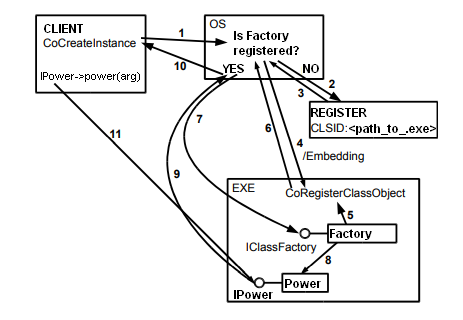
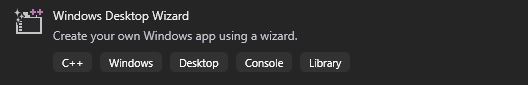
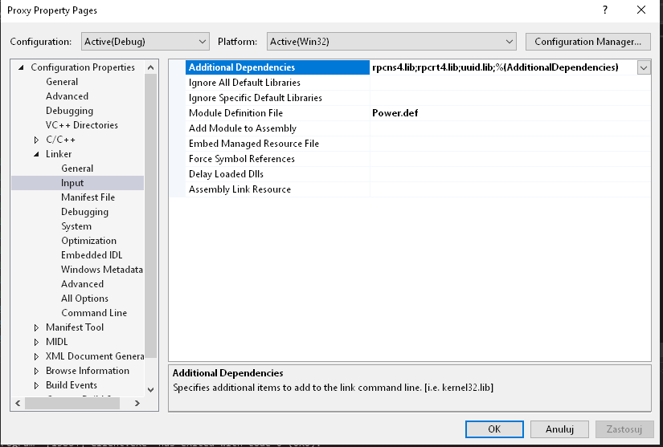
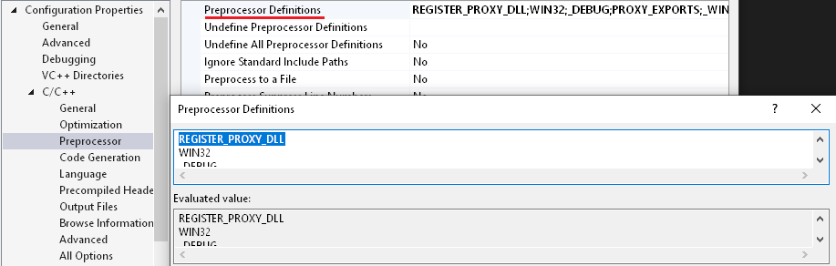
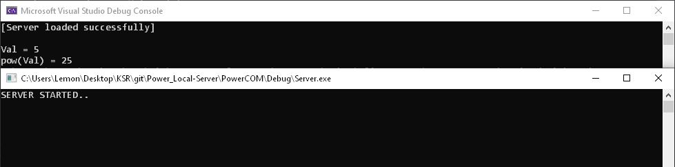

# COM-LocalServer-Power
Implementing Power class as Component Object Model (Local-Server) in C++

## Table of contents
* [General info](#general-info)
* [Work principle](#work-principle)
* [Setup](#setup)

## General info
This is the second type of how the COM (Component Object Model) can be registered and used. </br>

Here is an implementation of simple Power class and IPower interface as Component Object Model </br> 
that have only one function for raise a number to the power of two. </br>

For the Inproc-Server COM type, we creating:
* one .exe project (Server)
* one .dll project (Proxy&Stub)
* second .exe project (Client). </br>


## Work principle
 </br>
1. The CoCreateInstance call queries the operating system for a registered class object Factory with the specified CLSID.
2. If the Factory is registered, we go straight to point 7; otherwise, it is searched for in the registry path to the executable.
3. The operating system finds the path.
4. The executable (server) is run with the /Embedding parameter.
5. The executable creates a class Factory.
6. The executable calls CoRegisterClassObject with a Factory as one of the arguments.
7. The system calls the CreateInstance method from the registered factory.
8. CreateInstance gets a pointer to the IPower interface from the Power object.
9. CreateInstance returns a pointer to IPower
10. CoCreateInstance returns to the client a pointer to IPower.
11. The client uses the Power object via the IPower interface.

## Setup
To run this project:
1. Create the Console Application project in Visual Studio for the Server </br>
(you can do it by click "Windows Destop Wizard" and choose console app) </br>
 </br>

2. Add all .cpp and .h files from github (Server/...) to your project. </br>

3. Next step is to register the server. You can write your .reg file with the following code: </br>
```
REGEDIT4

[HKEY_CURRENT_USER\Software\Classes\Wow6432Node\CLSID\{YOUR_CLASS_CLSID}]
@="<class_name>"
[HKEY_CURRENT_USER\Software\Classes\Wow6432Node\CLSID\{YOUR_CLASS_CLSID}\LocalServer32]
@="<path_to_Server.exe"
"ServerExecutable"="<path_to_Server.exe"
``` 
* Write your CLSID in place of YOUR_CLASS_ID (you can generate CLSID in Visual Studio by clicking Tools->Create GUID. </br>
* Provide the path to the execution server file. To register server double click for the .reg file. </br>
* <b>!DON'T FORGET TO CHANGE ALL GUID's IN PROJECT FILES TO YOURS! </b></br>

4. Add a new Dynamic-link library project to your Solution.
5. Only that you need is the .idl file that automatically generates all needed files for Proxy and Stub. <br>
```
import "oaidl.idl";
[object, uuid(YOU_INTERFACE_GUID)]
interface IPower : IUnknown {
	HRESULT power([in,out]int *val);
};
```
&nbsp; &nbsp; &nbsp; You can run this code by clicking right-click to the .idl file in VS Solution Explorer and then "Compile". </br>
&nbsp; &nbsp; &nbsp; All generated files (.h, .cpp) should be added to the Proxy project.

6. Create definition file, for exporting functions. </br>
```
LIBRARY Proxy.dll

EXPORTS
	DllCanUnloadNow PRIVATE
	DllGetClassObject PRIVATE
	DllRegisterServer PRIVATE
	DllUnregisterServer PRIVATE
```
&nbsp;&nbsp;&nbsp;Next you need to add this file in Proxy project properties in Module Definition File section. </br>
&nbsp;&nbsp;&nbsp;And add this libraries: rpcns4.lib, rpcrt4.lib, uuid.lib in Additionals Dependences section. </br>
&nbsp;&nbsp;&nbsp; </br>

7. In Proxy properties go to the (C/C++)->Preprocessor->Prepocessor Definition and add this line: </br>
REGISTER_PROXY_DLL
 </br> 
Also, you need to specify Proxy CLSID (before generate it). </br>
In properties go to (C/C++)->Command Line and write this:
```
/D"PROXY_CLSID_IS={YOUR_PROXY_GUID}" 
```

All this is required to automatically register your proxy and stub. </br>
But optionally you can do it manually with the .reg file </br>

```
REGEDIT4

[HKEY_CURRENT_USER\Software\Classes\Wow6432Node\Interface\{YOUR_INTERFACE_IID}]
@="IPower"
[HKEY_CURRENT_USER\Software\Classes\Wow6432Node\Interface\{YOUR_INTERFACE_IID}\ProxyStubClsid32]
@="{YOUR_PROXY_GUID}"
[HKEY_CURRENT_USER\Software\Classes\Wow6432Node\CLSID\{YOUR_PROXY_GUID}]
@="PSFactoryBuffer"
[HKEY_CURRENT_USER\Software\Classes\Wow6432Node\CLSID\{YOUR_PROXY_GUID}\InprocServer32]
@="<path_to_Proxy.dll>"
"ThreadingModel"="Both"
```

8. Add new Console Application project to your Solution (Client). </br>
Copy and add all .h and .cpp files from github (Client/...) </br>

9. Build Solution and run the Client. </br>
If the application is run successfully you will see the consoles like this:
 </br>

### Congratulation you build your Local-Server COM!
